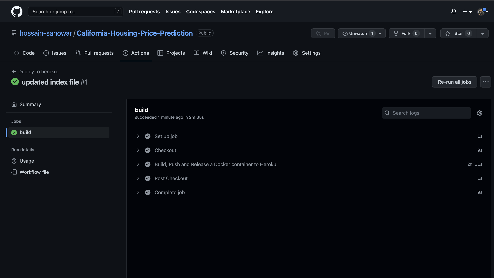
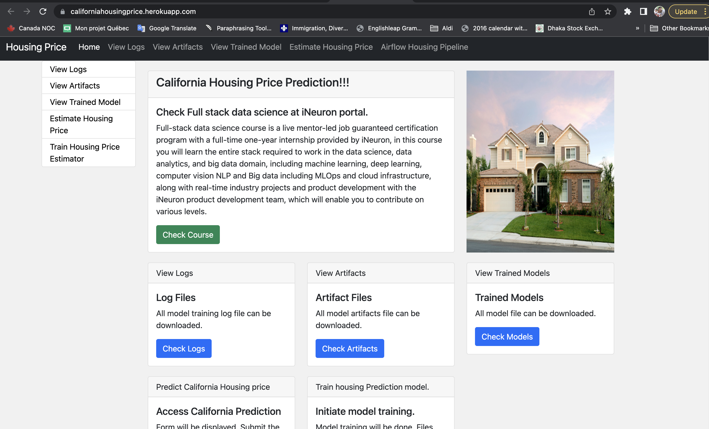

# California-Housing-Price-Prediction - Deployment

  

Welcome to the California Housing Corporation for Machine Learning! The first task is to create a model of California property prices using census data. Each California census tract's demographics and economics are broken down here, with numbers like population, average income, and average home cost at the fingertips. Block groups (a block group generally has a population of 600 to 3,000 persons) are the smallest geographic unit for which the United States Census Bureau publishes sample data; these groupings are referred to as "districts" for reference. With the use of this Machine Learning model, this program would be able to make educated guesses about the median home price in each neighborhood, given the other data.

Dataset Link: https://www.kaggle.com/datasets/camnugent/california-housing-prices
## web app

## CI/CD Pipeline using GitHub Actions

## Cloud Application

## Project Steps:

1. Create a github repo.
2. Create templates folder using bash_script/pyscript/cookiecutter template
3. Create setup file for packages and virtual environment
4. Create requirements.txt file for necessity libraries
5. Create Flask API for web application
6. Push in GitHub
7. Create an Account in heroku for new project
8. Create Docker image
9. Build CI/CD Pipeline through GitHub Actions

Yaml File Link: <a href="https://github.com/marketplace/actions/build-push-and-release-a-docker-container-to-heroku">Build and Deploy Docker image to Heroku container.</a>

